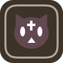

<!-- PROJECT LOGO -->
<div align="center">
  <a href="https://github.com/slimelab060/konosubainfonextjs">
    
  </a>

<h2 align="center">このファンまとめサイト UI</h2>

  <p align="center">
    サイトのUIソースコード
  </p>
</div>

[![license-shield][license-shield]][license-url]  

## 1. このレポジトリについて

[![Product Name Screen Shot][product-screenshot]](https://example.com)

これはデザインのみ公開しているソースコードです。  
まだ開発途中なのでコンポーネントが少ないです。  
データは非公開です。

## 2. 環境構築

このサイトの開発環境は以下の通りです。  

[![Next][Next.js]][Next-url]
[![React][React.js]][React-url]

### 2.1. 前提条件

環境を構築するにはNode.jsが必要

  ```sh
  npm install npm@latest -g
  ```

### 2.2. Installation

1. レポジトリからクローン

   ```sh
   git clone https://github.com/slimelab060/konosubainfonextjs.git
   ```

2. 必要な依存関係をインストール

   ```sh
   npm install
   ```

3. コマンド入力でデバッグ環境構築

   ```sh
   npm run dev
   ```

## 3. ロードマップ

これは現状作成するものを書いただけです。  
期間は特になしです。  
今後少しずつ項目は増えていきます。

- [x] ホームページ
- [x] タブ機能追加
- [x] よく使う定数追加
- [ ] 記事テンプレート
- [ ] TOC追加
- [ ] フィルター選択
- [ ] コードの最適化

## 4.更新履歴

  履歴が増えてきたら別の場所に移動します。  

- 0.4-C7-231003
  - タイムライン追加
  - カウントダウン試験的に追加
  - 定数を定義しているファイルをdataに移動

- 0.4-C6-231002
  - コンポーネントリスト追加
  - 一部のコンポーネントから動的に呼び出し可能に変更
  - 細かな修正
  - ダミー文書追加
  - 実験的に機能追加

- 0.4-C5-231001
  - 仮のコンテンツ作成
  - MDX読み込み対応(仮組み)
  - 一部カラー修正(今後も変更有り)

- 0.4-C4-230928
  - レイアウト修正
  - 色を調整(まだ完全ではない)
  - デフォルトの404ページだと色の変数が反映しない問題を修正
  - エラーページを必要最小限カスタマイズ

- 0.4-C3-230926
  - タブ追加
  - Nextjs13.5にアップグレード

- 0.4-C2-230923
  - メニューバー変更
  - 色の変数をグローバル化

- 0.4-230918
  - クイックメニューの場所変更
  - レイアウト変更

- 0.3-230912
  - ユーザビリティ向上
  - カーセル周りを修正
  - コンテンツ導入準備開始

- 0.2-230802
  - embla_carousel導入
  - 細かな修正

- 0.1-230716
  - 公開
  - Nuxt3からの移植

## 5. ライセンス

 MIT License.

<!-- MARKDOWN LINKS & IMAGES -->
<!-- https://www.markdownguide.org/basic-syntax/#reference-style-links -->
[license-shield]: https://img.shields.io/github/license/slimelab060/konosubainfonextjs.svg?style=for-the-badge
[license-url]: https://github.com/slimelab060/konosubainfonextjs/blob/main/LICENSE
[product-screenshot]: doc/images/product.png
[Next.js]: https://img.shields.io/badge/next.js-000000?style=for-the-badge&logo=nextdotjs&logoColor=white
[Next-url]: https://nextjs.org/
[React.js]: https://img.shields.io/badge/React-20232A?style=for-the-badge&logo=react&logoColor=61DAFB
[React-url]: https://reactjs.org/
